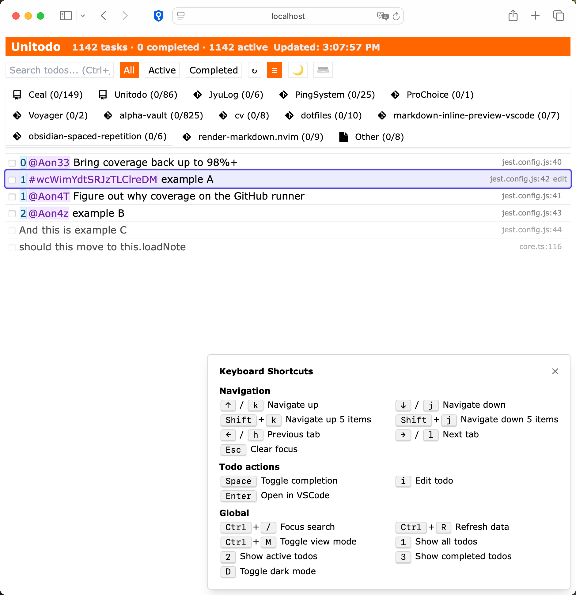

# Unitodo

**Unitying Distributed TODOs**

Centralize all your TODOs from across your entire codebase and projects into a single, manageable, vim-able view.

<!--  -->

> ⚠️ **Warning**: Unitodo is currently a toy project in early development stage. It may contain bugs, lack features, or undergo significant changes. Use at your own risk in production environments.

> ⚠️ **Warning**: This doc (and most of the code) was AI-generated because life’s short — polish coming later!

## Overview

Unitodo is a powerful solution that helps developers and teams track all their TODOs across different files, projects, and repositories. The tool assigns unique IDs to each TODO item, collects them in real-time, and presents them in a unified interface for easy management.



### Architecture

Unitodo consists of two main components:

1. **Rust Backend**: Scans your codebase for TODOs using `ag` (the silver searcher), processes and categorizes them, and provides a REST API for the frontend.

2. **React Frontend**: A modern web interface for viewing, filtering, and managing your TODO items.

### Key Features

- **Distributed TODOs with Unique IDs**: Add TODOs anywhere in your codebase with a simple format
- **Centralized Management**: View and manage all your TODOs in one place
- **Priority System**: Easily prioritize your tasks with a simple numbering system
- **Timestamping**: Automatic tracking of when TODOs are created and completed
- **Modern Web Interface**: Filter, sort, and manage your TODOs with an intuitive UI
- **Markdown Support**: Basic markdown rendering for rich TODO descriptions

## Installation

- install `ag` (the silver searcher)

### Prerequisites

- Rust (for the backend)
- Node.js and npm (for the frontend)

### Setup

1. Clone the repository:
   ```bash
   git clone https://github.com/yourusername/unitodo.git
   cd unitodo
   ```

2. Build the backend:
   ```bash
   cargo build --release
   ```

3. Install frontend dependencies:
   ```bash
   npm install
   ```

## Usage

### Running Unitodo

1. Start the backend to aggregate TODOs:
   ```bash
   cargo run
   ```

2. Run the frontend development server:
   ```bash
   npm run dev
   ```

3. Open [http://localhost:3000](http://localhost:3000) in your browser

### Adding TODOs

Unitodo supports several TODO formats. Add them anywhere in your code or documentation:

```
T0DO 1@fffff content description
T0DO 1#Jl_obVmSA7XCwzp7hkT2r another task
- [ ] 2@AoVs5 third task with checklist format
```

#### Format Explained

- **Priority**: The number at the beginning (0-3 recommended, 0 being highest priority)
- **Identifier**: One of the following:
  - `@fffff` - Timestamp (5-character URL-safe base64 Unix timestamp)
  - `#Jl_obVmSA7XCwzp7hkT2r` - Unique nanoid (20 characters)
  - `##12` - Sequential numeric ID

- **Content**: The actual task description following the identifier

### Web Interface

The web interface offers:

- Grouping by categories (Project, Git Repo, Other)
- Filtering by status (All/Active/Completed)
- Editing of todo items
- Responsive design for desktop and mobile

## Best Practices

- Use the priority system (0-3) consistently:
  - `0`: Critical/urgent tasks
  - `1`: Important tasks
  - `2`: Normal priority tasks
  - `3`: Low priority/nice-to-have tasks
- Add unique IDs to TODOs that you want to track and edit
- Keep TODO descriptions concise but descriptive

## Known Limitations

- Currently supports one-line TODOs only
- Assumes all created timestamps are unique (not more than 1 todo per second)
- For bi-directional sync, assumes input TODOs maintain their position